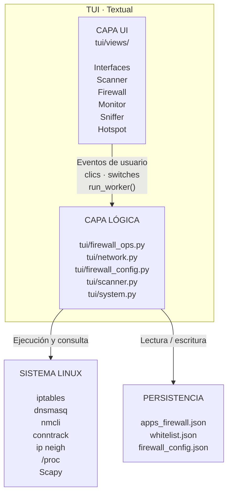
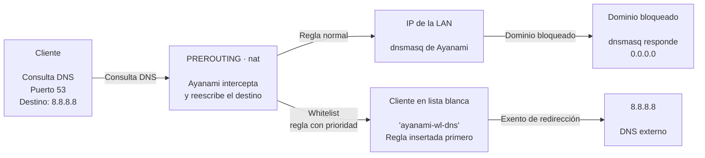
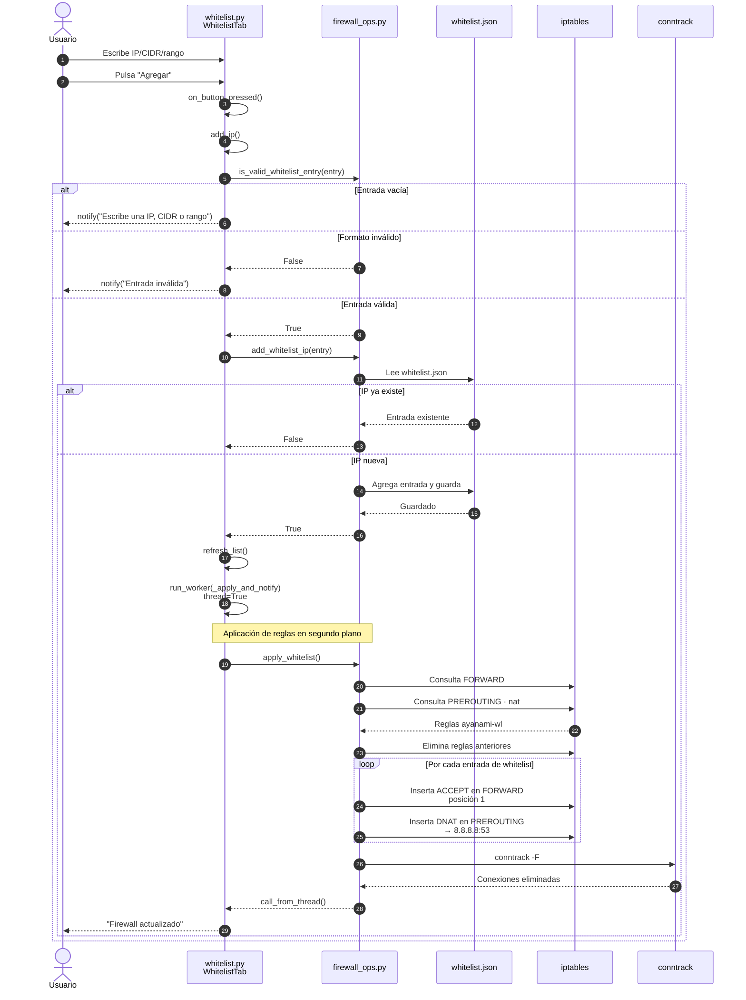
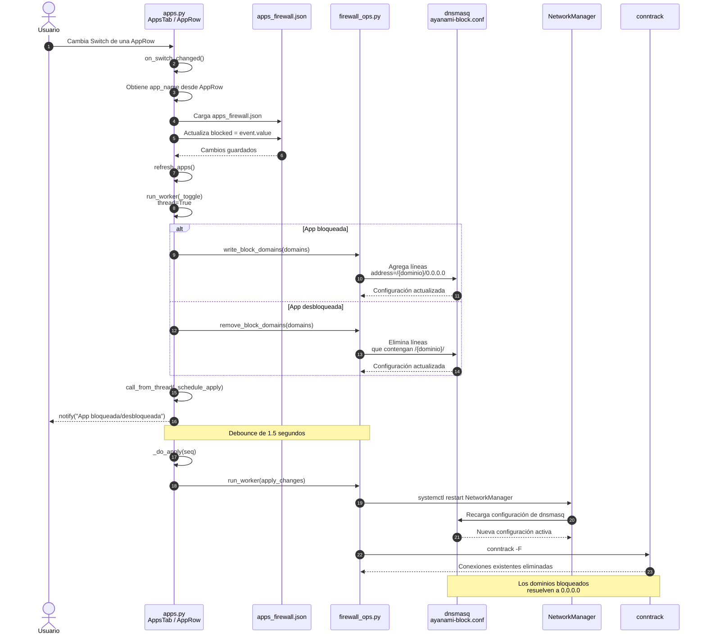
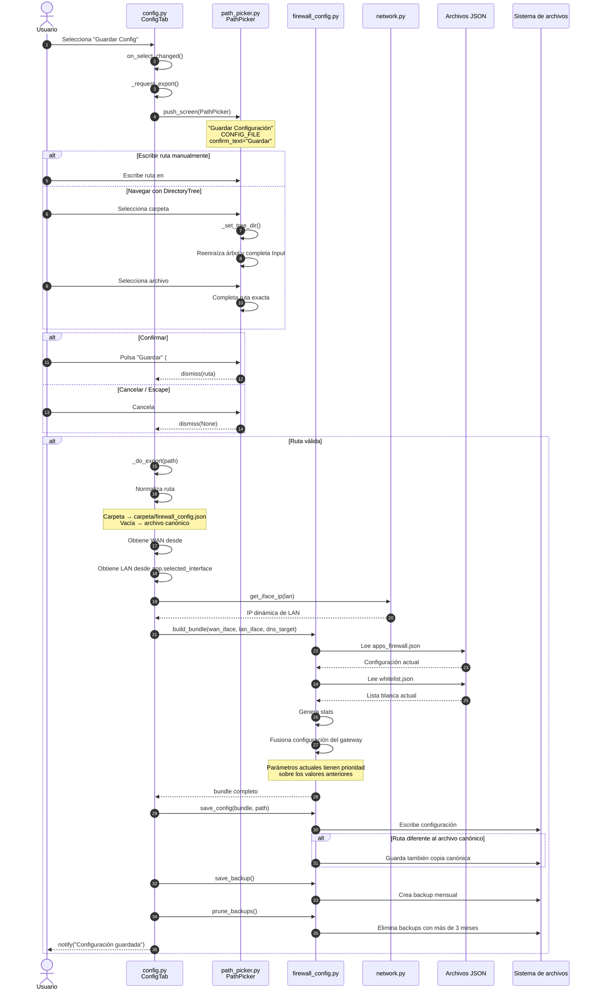
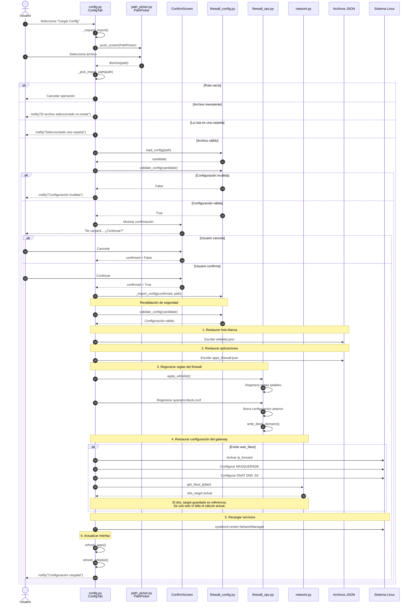
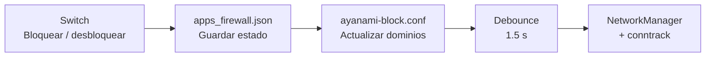

# Manual del Programador — Ayanami

> Guía para entender la arquitectura, la estructura del código y las convenciones del proyecto, se explican los conceptos desde cero, muestra recorridos del código real paso a paso y termina con guías prácticas para **modificar, corregir y agregar módulos o funciones nuevas**.

```
▄████▄ ██  ██ ▄████▄ ███  ██ ▄████▄ ██▄  ▄██ ██
██▄▄██  ▀██▀  ██▄▄██ ██ ▀▄██ ██▄▄██ ██ ▀▀ ██ ██
██  ██   ██   ██  ██ ██   ██ ██  ██ ██    ██ ██
```
---

## Contenido

1. [Panorama general](#1-panorama-general)
2. [Conceptos previos: Textual y red desde cero](#2-conceptos-previos-textual-y-red-desde-cero)
3. [Stack y dependencias](#3-stack-y-dependencias)
4. [Estructura del proyecto](#4-estructura-del-proyecto)
5. [Arquitectura de la TUI](#5-arquitectura-de-la-tui)
6. [Recorridos guiados por el código](#6-recorridos-guiados-por-el-código)
7. [El Firewall por dentro](#7-el-firewall-por-dentro)
8. [Persistencia y backups](#8-persistencia-y-backups)
9. [El tema visual (app.css)](#9-el-tema-visual-appcss)
10. [Convenciones de código](#10-convenciones-de-código)
11. [Organización de los commits](#11-organización-de-los-commits)
12. [Cómo agregar una vista nueva](#12-cómo-agregar-una-vista-nueva)
13. [Cómo agregar una pestaña al Firewall](#13-cómo-agregar-una-pestaña-al-firewall)
14. [Cómo agregar una función de firewall](#14-cómo-agregar-una-función-de-firewall)
15. [Guía de cambios: "cambiar X"](#15-guía-de-cambios-cambiar-x)
16. [Cómo probar sin romper nada](#16-cómo-probar-sin-romper-nada)
17. [Glosario](#17-glosario)
18. [Bugs y errores conocidos](#18-bugs-y-errores-conocidos)

---

## 1. Panorama general

Ayanami es una herramienta de **control de red y firewall** para Linux con dos interfaces:

- **TUI** (`tui/`) — interfaz de texto completa con **Textual**. Es el front-end **principal**, donde ocurre todo el desarrollo nuevo.
- **CLI** (`cli/`) — menús por consola sin Textual. Es **legacy/estable**: útil como referencia de funcionalidades que la TUI todavía no expone (bloqueo global de IPs, QUIC, bloqueo por dispositivo).

### Diagrama arquitectónico



La regla más importante para entender el proyecto: **la capa lógica no sabe que existe la TUI** (no importa `textual`). Esto permite:

- reutilizar `firewall_ops.py` desde distintos frentes,
- ejecutar `firewall_config.py` como script de systemd (hace backups sin abrir la interfaz),
- probar la lógica con tests simples.

El proyecto empezó como CLI y la TUI se construyó encima, reutilizando comandos del sistema (`nmcli`, `iptables`, `ip`) en lugar de librerías de red.

---

## 2. Conceptos previos: Textual y red desde cero

> Si ya se cuenta con conocimiento sobre Textual e iptables/dnsmasq, saltar a la sección 4. Esto es para quien nunca los usó.

### 2.1 Textual en una cápsula (lo mínimo para leer la TUI)

Textual (versión 8.x) permite programar interfaces de texto como si fueran **HTML + CSS + JavaScript**:

| Concepto | Analogía web | En Textual |
|---|---|---|
| **Widget** | un elemento HTML | cualquier componente (`Button`, `Label`, `Select`, `Switch`, `DataTable`, ...). Todo es un widget, incluso tus vistas. |
| **Árbol de widgets** | el DOM | los widgets se anidan: una vista (`Vertical`) contiene botones, inputs, listas... |
| **`compose()`** | el `render()` que arma el DOM | método que hace `yield` de los widgets hijos. Textual lo llama al montar. |
| **`id` y `class`** | `id` / `class` | `Button("Agregar", id="wl-add", classes="wl-add-btn")`. Los ids son únicos y se usan para encontrar el widget; las clases agrupan estilos. |
| **`query_one("#id", Tipo)`** | `document.querySelector` | busca un widget por id (y/o por tipo). Ej: `self.query_one("#wl-input", Input)`. |
| **CSS** | CSS | archivos `.css` de Textual con selectores por tipo (`Vertical { }`), id (`#wl-add { }`) y clase (`.fw-card { }`). Ayanami tiene **un solo archivo**: `tui/styles/app.css`. |
| **Eventos** | eventos de DOM | todo lo que pasa es un *mensaje* (`Button.Pressed`, `Input.Changed`, `Select.Changed`, `Switch.Changed`, `DataTable.RowSelected`...). |
| **Handlers `on_*`** | `addEventListener` | un método `on_<evento>` recibe el evento. E.g. el evento `Button.Pressed` lo maneja `on_button_pressed(self, event)`. **El nombre del método sale del nombre del evento en snake_case.** |
| **Burbujeo** | *event bubbling* | el evento nace en el widget y viaja hacia arriba por sus ancestros. Por eso una **vista** puede manejar los clics de todos los botones que contiene en un solo `on_button_pressed`. |
| **Screen** | una *ruta/página* | una pantalla completa. Los modales son `Screen`s. |
| **`push_screen` / `dismiss`** | abrir ruta / devolver valor | `self.app.push_screen(Modal(...), callback)`: muestra el modal y guarda el `callback`; cuando el modal llama `self.dismiss(valor)`, el `callback(valor)` se ejecuta. |
| **`run_worker`** | un *worker/thread* | ejecuta una función en un **hilo** para no congelar la UI (`thread=True`). |
| **`set_timer` / `set_interval`** | `setTimeout` / `setInterval` | ejecutan algo una vez / repetidamente. |
| **`app.notify`** | un *toast* | notificación flotante: `self.app.notify("texto", severity="error")`. |
| **`on_mount`** | `useEffect` al montar | se ejecuta cuando el widget entra en pantalla; es donde se cargan datos iniciales. |

**Cómo leer un handler** — este patrón aparece en TODO el proyecto:

```python
def on_button_pressed(self, event: Button.Pressed):
    btn_id = event.button.id        # todos los botones llegan aqui
    if btn_id == "wl-add":          # desacopla por id
        self.add_ip()
    elif btn_id.startswith("wl-del-"):   # ids con datos: prefijo + safe_id
        ...
```

### 2.2 Red y firewall desde cero (para entender por qué las reglas)

Ayanami asume que el equipo actúa como **gateway**: tiene una interfaz hacia internet (**WAN**) y otra hacia los dispositivos (**LAN**). En la TUI, la LAN es la **"interfaz global"** elegida en la barra lateral.

Conceptos que conviene tener claros:

| Concepto | Qué es | Por qué importa |
|---|---|---|
| **`ip_forward`** | parámetro del kernel que permite reenviar paquetes entre interfaces | sin esto los clientes de la LAN no navegan a través del equipo. `sysctl -w net.ipv4.ip_forward=1`. |
| **Tablas y cadenas de iptables** | iptables organiza reglas en *tablas* (`filter`, `nat`, ...) y cada una en *cadenas* que se recorren en orden | se usan `filter/FORWARD` y `nat/PREROUTING`, `nat/POSTROUTING`. |
| **`FORWARD`** (tabla filter) | cadena por la que pasan los paquetes que **atraviesan** el router (de LAN hacia internet y viceversa) | es donde se bloquea/exime tráfico de los clientes. |
| **`PREROUTING`** (tabla nat) | se recorre **antes** de decidir a dónde va un paquete | permite *reescribir el destino* con `DNAT`. |
| **`POSTROUTING`** (tabla nat) | se recorre **después** de decidir el destino | permite *reescribir el origen* con `MASQUERADE`. |
| **`MASQUERADE`** | NAT de salida: los clientes salen a internet con la IP del equipo | regla clave del gateway (`-o <wan> -j MASQUERADE`). |
| **`DNAT`** | NAT de destino: reescribe el destino del paquete | ejemplo: toda consulta al puerto 53 (DNS) va a parar al dnsmasq local → Ayanami puede **filtrar dominios**. |
| **dnsmasq** | servidor DNS liviano que NetworkManager levanta para el hotspot | Ayanami escribe `address=/{dominio}/0.0.0.0` en la config de dnsmasq; dnsmasq responde "no existe" para ese dominio (bloqueo). |
| **`conntrack`** | tabla de conexiones establecidas del kernel | `conntrack -F` las corta para que **las reglas nuevas se apliquen ya** (una conexión ya abierta no se re-evalúa). |
| **`nmcli`** | cliente de línea de comandos de NetworkManager | listar interfaces (`nmcli device status`), crear hotspot, WiFi. |
| **`ip neigh`** | tabla de vecinos (ARP) | de aqui sale la lista de dispositivos del Scanner. |

**El flujo DNS completo del gateway** (esto perimite entender el proceso de configuración):



---

## 3. Stack y dependencias

Fijadas en `requirements.txt`:

| Paquete | Uso |
|---|---|
| `textual==8.2.8` | Framework de la TUI (widgets, screens, workers, CSS) |
| `scapy==2.7.0` | Captura y análisis de paquetes (Sniffer y Monitor) |
| `python-nmap==0.7.1` | Fingerprint de puertos/servicios en el Scanner |
| `qrcode==8.2` | Código QR ASCII de la contraseña del hotspot |
| `rich==15.0.0` | Formato de texto enriquecido (usado por Textual por debajo) |

Dependencias del **sistema** (no pip): `nmcli` (NetworkManager), `iptables`, `dnsmasq`, `iftop`, `nmap`, `arp-scan`.

### Importante: cómo se ejecuta y por qué

Los imports dentro de `tui/` son **planos** (sin prefijo de paquete):

```python
import firewall_ops              # no es "tui.firewall_ops"
from views.firewall.apps import AppsTab
import network
```

Esto funciona porque la TUI se lanza **con el directorio `tui/` como cwd**, de modo que Python lo agrega al `sys.path`:

```bash
cd tui
sudo venv/bin/python tui.py
```

Consecuencia práctica: **los archivos nuevos de `tui/` se importan plano, sin prefijo `tui.`**.

---

## 4. Estructura del proyecto

```
/
├── README.md                # documentación de usuario
├── ManualUsuario.md         # manual de usuario (qué hace cada pantalla)
├── ManualProgramador.md     # ← este documento
├── PROBLEMAS.txt            # diagnóstico del hotspot roto (dnsmasq)
├── requirements.txt         # dependencias pip
├── .gitignore               # __pycache__, backups/, firewall_config.json
│
├── whitelist.json           # lista blanca ACTIVA (la editan los tabs y firewall_ops)
├── apps_firewall.json       # apps + dominios ACTIVOS (la editan los tabs y firewall_config)
├── firewall_config.json     # bundle unificado (NO se commitea; lo regenera la app)
├── backups/                 # backups mensuales (no se commitean)
│
├── systemd/
│   └── install_backup_timer.sh   # instalador/desinstalador del timer mensual
│
├── venv/                    # entorno virtual (no se commitea)
│
├── cli/                     # front-end CLI legacy
│   ├── ayanami.py           # menú principal (entrada: sudo python3 cli/ayanami.py)
│   ├── firewall.py          # menú firewall CLI (12 opciones)
│   ├── firewall_apps.py     # menú apps CLI
│   ├── network.py / gateway.py / scanner.py / monitor_bw.py / sniffer.py / colors.py
│
└── tui/                     # ═══ FRONT-END PRINCIPAL (desarrollo nuevo) ═══
    ├── tui.py               # AyanamiApp: define la app, las vistas y la navegación
    │
    ├── firewall_ops.py      # lógica firewall: whitelist, dominios, iptables (sin Textual)
    ├── firewall_config.py   # bundle unificado + backups + CLI para systemd (sin Textual)
    ├── network.py           # nmcli + obtener IP de una interfaz (sin Textual)
    ├── scanner.py           # ip neigh / arp-scan / nmap / hostname (sin Textual)
    ├── system.py            # métricas del sistema (/proc, ps, sysctl) (sin Textual)
    │
    ├── styles/app.css       # TEMA ÚNICO de toda la app (Tokyo Night, ~1600 líneas)
    │
    ├── widgets/             # componentes reutilizables
    │   ├── sidebar.py       # barra lateral + selector de interfaz global
    │   ├── confirm_screen.py# modal de confirmación genérico (Sí/No)
    │   ├── path_picker.py   # modal para elegir una ruta (input + árbol de directorios)
    │   ├── app_row.py       # una fila de app (switch + modificar + eliminar)
    │   └── interface_row.py # una fila de interfaz (tipo, estado, botones)
    │
    └── views/               # las pantallas (una por módulo de la app)
        ├── interfaces.py    # vista "Interfaces"
        ├── hotspot.py       # vista "Hotspot" (crea el punto de acceso WiFi)
        ├── scanner.py       # vista "Scanner"
        ├── monitor.py       # vista "Monitor" (tráfico en tiempo real)
        ├── sniffer.py       # vista "Sniffer"
        ├── sistema.py       # vista "Sistema" (dashboard)
        └── firewall/        # módulo firewall: contiene sus propias sub-pestañas
            ├── __init__.py  # FirewallView: el contenedor con sus tabs
            ├── apps.py      # AppsTab: CRUD de apps + bloqueo por dominio
            ├── whitelist.py # WhitelistTab: lista blanca + IPRow
            ├── config.py    # ConfigTab: gateway, estado, limpiar, guardar/cargar
            └── app_modal.py # AppModal: formulario Registrar/Modificar app + APP_TYPES
```

> **Consejo de lectura**: Para entender el funcionamiento de una pantalla, abrir la vista (`views/*.py`) y seguir el orden `compose()` → `on_mount()` → handlers `on_*`. Para ver **cómo modifica el sistema**, seguir los imports hacia `firewall_ops.py`, `network.py`, etc.

---

## 5. Arquitectura de la TUI

### 5.1 Qué pasa al arrancar la app (recorrido de bootstrap)

1. `tui/tui.py` ejecuta `AyanamiApp().run()`.
2. Textual instancia la app y llama `compose()`, que declara: `Header` (arriba), `Horizontal(Sidebar, ContentSwitcher)` (el cuerpo) y `Footer` (abajo, muestra las teclas).
3. El `ContentSwitcher` con `initial="nav-interfaces"` muestra la primera vista; todas las vistas existen montadas **en paralelo** (el switcher solo decide cuál se ve).
4. `on_mount()` de la app activa la navegación a Interfaces y programa el auto-refresco de Sistema (1 segundo).
5. Cada vista, en su propio `on_mount()`, carga sus datos iniciales. **La lista de Apps y los datos de Sistema son la excepción**: se cargan al abrir esas vistas (`ensure_loaded()` / `refresh_data()`), porque pintarlos al arrancar hacía que la app tardara 27 s (ver 5.8).

**Punto clave del diseño**: cambiar de pestaña es solo `ContentSwitcher.current = id`. No se destruyen ni recrean las vistas: **los datos de una vista viven mientras la app corre**. Por eso "montada" no es lo mismo que "pintada": una vista puede estar en el DOM sin haber construido sus listas.

### 5.2 `AyanamiApp` (`tui/tui.py`)

Información importante:

```python
class AyanamiApp(App):
    CSS_PATH = "styles/app.css"       # un solo tema para toda la app
    ENABLE_COMMAND_PALETTE = False
    capture_print = True              # el print() de los hilos no rompe la UI
    selected_interface = None         # ⚠️ ESTADO GLOBAL de la app (ver abajo)

    BINDINGS = [                      # teclas globales
        Binding("q", "quit", "Salir"),
        Binding("r", "refresh", "Actualizar Vista"),
    ]
```

- **`selected_interface` es el "estado global"**: lo escribe la barra lateral (`Sidebar`) y la vista Interfaces (botón "Global"); lo leen Hotspot, Scanner, Monitor, Sniffer y el gateway (como **LAN**). Si se agreaga una vista que necesita saber "qué interfaz estoy usando", leer `self.app.selected_interface`.
- `NAV_ORDER` es la lista de ids de navegación. `on_button_pressed` recibe el clic de cualquier botón de la app con id en esa lista y hace `ContentSwitcher.current = btn_id`. **Por eso los botones del sidebar tienen el mismo id que las vistas** (`nav-firewall` → `FirewallView(id="nav-firewall")`).
- `action_refresh()` (tecla `r`) refresca varias vistas **menos el firewall** (las listas del firewall se refrescan solas con cada acción).

### 5.3 El patrón de una vista 

Este es el esqueleto de cualquier vista del proyecto (`views/interfaces.py`, el ejemplo más corto):

```python
class InterfacesView(Vertical):                       # 1. La vista ES un widget contenedor

    def compose(self) -> ComposeResult:               # 2. Declarar el esqueleto de widgets
        yield Horizontal(Label("Interfaces...", classes="title"),
                         Button("Refresh", variant="primary", id="refresh"),
                         classes="topbar")            #    "classes" agrupa estilos
        yield Horizontal(... id="interfaces-header")  #    "id" identifica para lógica later
        yield Vertical(id="interfaces-container")     #    contenedor vacío: se llena SOLO

    def on_mount(self):                               # 3. Al montar, cargar datos
        self.refresh_data()

    def refresh_data(self):                           # 4. Poblar/re-poblar la lista
        container = self.query_one("#interfaces-container", Vertical)
        container.remove_children()                   #    "nuevo render": borrar y volver a montar
        for iface in network.get_interfaces_detailed():
            container.mount(InterfaceRow(iface))      #    cada fila es un widget propio

    def on_button_pressed(self, event):               # 5. Todos los clics aqui, por id
        if event.button.id == "refresh":
            self.refresh_data()
        elif event.button.id.startswith("global-"):
            self.set_global_interface(event.button.id.replace("global-", ""))
```

Reglas de este patrón:

1. `compose()` **solo declara** el árbol de widgets. No consulta al sistema ni hace cálculos.
2. El `on_mount()` dispara la primera carga de datos; el método de refresco se reutiliza para recargas.
3. Las listas se reconstruyen con `remove_children()` más volver a montar filas. Es el mismo patrón en Interfaces, Apps y Whitelist.
4. Un solo handler `on_button_pressed` por vista, desacoplado por `event.button.id`. Los handlers de otros eventos (`Select.Changed`, `Switch.Changed`, `Input.Submitted`, `DataTable.RowSelected`) siguen la misma idea.

### 5.4 Rows: filas como widgets

En lugar de tablas gigantes, el proyecto arma **filas como widgets propios** en `tui/widgets/`. Cada fila:

- guarda su dato en atributos (`self.app_name`, `self.ip_entry`) para que la vista lo recupere,
- genera ids derivados del dato con `safe_id()` (ver convenciones).

```python
class AppRow(Horizontal):
    def __init__(self, app_name, app_data):
        super().__init__()
        self.app_name = app_name                    # la vista lo lee después
        self._switch_id = f"app-switch-{safe_id(app_name)}"   # ids con prefijo verbo-
    def compose(self):
        yield Switch(value=..., id=self._switch_id, classes="app-row-switch")
        yield Button("Modificar", id=self._modify_id, ...)
```

La vista que lo monta, cuando recibe un clic con id `app-modify-...`, **sube por los padres hasta encontrar un `AppRow`** y lee `app_name`:

```python
node = event.button
while node is not None:
    if isinstance(node, AppRow):
        app_name = node.app_name
        break
    node = node.parent
```

### 5.5 Modales (Screens que devuelven un valor)

Un modal es una `Screen` que termina llamando a `self.dismiss(valor)`. El código que lo abrió pasó un callback, y ese callback recibe el valor:

```python
# — lado que abre —
self.app.push_screen(
    ConfirmScreen("¿Eliminar app 'x'?"),   # screen
    self.on_confirm                        # callback(True) si confirma, (None) si cancela
)

# — dentro de ConfirmScreen (widgets/confirm_screen.py) —
def on_button_pressed(self, event):
    if event.button.id == "confirm-yes":
        self.dismiss(True)       # el callback recibe True
    else:
        self.dismiss(False)
```

Los tres modales que ya existen y que se pueden reutilizar:

| Modal | Qué devuelve `dismiss` | Uso |
|---|---|---|
| `ConfirmScreen(texto, confirm_text="Eliminar")` | `True` / `False` | confirmar acciones destructivas (quitar IP, eliminar app, limpiar firewall) |
| `PathPicker(titulo, default_path, confirm_text="Aceptar")` | `str` con la ruta / `None` | elegir una ruta para guardar/cargar configuración |
| `AppModal(...)` | `{"name","type","domains","blocked"}` / `None` | registrar o modificar una app |

> ⚠️ Los modales **no** se confirman con `Enter`; se hace clic en el botón (o Tab+Enter sobre él). No está definido un binding de Enter.

### 5.6 Trabajo pesado: `run_worker` y `call_from_thread`

Todo lo que toca el sistema (iptables, dnsmasq, reinicios, capture) corre en **hilos**, porque si no la UI se congela:

```python
self.run_worker(mi_funcion_lenta, name="identificador", group="firewall", thread=True)
```

- `group="firewall"` agrupa workers (no es obligatorio, pero es la convención del proyecto).
- ⚠️ **Desde un hilo no se puede tocar la UI directamente.** Para notificar o refrescar desde el hilo:

```python
self.app.call_from_thread(self.notify, "mensaje del hilo")
self.app.call_from_thread(self._schedule_apply)
```

### 5.7 Debounce (evitar reinicios innecesarios)

Reiniciar NetworkManager corta la red. Por eso, al togglear varios switches rápido (bloquear o desbloquear apps), el reinicio se posterga 1.5 s y solo el **último** cambio lo dispara:

```python
def _schedule_apply(self):
    self._apply_seq += 1                # invalidar timers anteriores
    seq = self._apply_seq
    self.set_timer(1.5, lambda: self._do_apply(seq))

def _do_apply(self, seq):
    if seq != self._apply_seq:          # hubo un cambio más nuevo: no aplicar lo viejo
        return
    self.run_worker(apply_changes, name="apply-changes", group="firewall", thread=True)
```

### 5.8 Rendimiento: listas largas (paginación, carga diferida, montaje en lote)

Con muchas apps registradas, pintar la lista entera en cada interacción **congela la app**. Medido en este proyecto, con 97 apps:

| Situación | Antes | Después |
|---|---|---|
| Arranque de la app | 27,5 s | 0,9 s |
| Refresco completo de la lista | 22 s | ~0,5 s |
| Cada tecla del buscador | 1,7 s | ~0,06 s |
| Cada fila: 13 widgets → 97 apps | 1.261 widgets | 325 (solo 25 filas) |

Son cuatro técnicas, todas en `views/firewall/apps.py`:

**a) Montar en una sola llamada.** `for f in filas: container.mount(f)` recalcula el layout en cada montaje (cuadrático). `container.mount(*filas)` monta todo de una vez: **22 s → 2,9 s**.

**b) Paginación.** Cada `AppRow` crea ~13 widgets. Se muestran solo `PAGINADO_FILAS` (25) y el botón **Cargar más** agrega el siguiente tramo con otro `mount(*nuevas)`, sin repintar lo que ya está.

```python
PAGINADO_FILAS = 25

def refresh_apps(self):
    items = self._filtered_names()                       # lee el JSON y filtra/ordena
    filas = [AppRow(n, i) for n, i in items[:self._pagina]]
    container.remove_children()
    if filas:
        container.mount(*filas)                          # ← una sola llamada
    self._update_footer(len(filas), len(items))
```

**c) Carga diferida (`ensure_loaded`).** El `ContentSwitcher` monta **todas** las vistas aunque no se vean, así que un `on_mount()` que pinte 1.000 widgets se paga al arrancar. La lista se dibuja la primera vez que se abre la pestaña:

```python
def ensure_loaded(self):                # en AppsTab
    if self._loaded:                   # solo una vez
        return
    self.refresh_apps()                # refresh_apps() pone _loaded = True
```

Se llama desde dos lugares: `AyanamiApp.on_button_pressed` (al navegar a `nav-firewall`, porque la pestaña Apps es la inicial del Firewall) y `FirewallView.on_button_pressed` (al hacer clic en la pestaña Apps). `SistemaView` usa el mismo patrón con `refresh_data()`.

> ⚠️ **Advertencia**: los widgets `Select` disparan `Select.Changed` **al montarse** (Textual les asigna el valor inicial). Si ese handler refresca la lista, la carga diferida no sirve de nada. Por eso el handler filtra con `if self._loaded:`.

**d) No reconstruir la lista para cambiar un dato.** Alternar un switch solo cambia esa fila: se actualiza **en sitio** con `AppRow.update_state()` (`set_class` + `Label.update`), sin quitar ni montar widgets:

```python
def update_state(self, blocked: bool):       # en widgets/app_row.py
    self._accent.set_class(blocked, "app-accent-blocked")
    self._status.update("BLOQUEADA" if blocked else "DESBLOQUEADA")
```

**e) Debounce del buscador.** `Input.Changed` llega en cada tecla. Se espera a que el usuario pare (`BUSQUEDA_DELAY = 0.25` s) con el mismo patrón de contador de 5.7, así que al escribir rápido la lista se repinta una sola vez.

> 💡 **Para medir**: `App.run_test()` de Textual corre la app headless y es ideal para cronometrar. Sirve para comparar antes/después sin tocar la red real. Ojo: nunca hay que triggear un `Switch` en una prueba, porque el worker termina reiniciando NetworkManager de verdad.

---

## 6. Recorridos guiados por el código

Estos son **flujos completos** con los nombres exactos de archivos y funciones, para mostrar la funcionalidad de todo.

### 6.1 Recorrido A — Agregar una IP a la lista blanca

**Archivos involucrados**: `tui/views/firewall/whitelist.py` → `tui/firewall_ops.py`.

1. El usuario escribe `192.168.1.100` en el `Input #wl-input` y pulsa **"Agregar"** (`Button #wl-add`).
2. `WhitelistTab.on_button_pressed` (whitelist.py) ve `btn_id == "wl-add"` → llama `self.add_ip()`.
   *(Si en cambio el usuario pulsa `Enter`, es `on_input_submitted` con `event.input.id == "wl-input"` → también `add_ip()`.)*
3. `add_ip()` valida:
   - input vacío → `notify("Escribe una IP, CIDR o rango", severity="warning")` y se corta.
   - `is_valid_whitelist_entry(entry)` comprueba las tres regex de `firewall_ops.py` (`IP_RE`, `CIDR_RE`, `RANGE_RE`). Si no matchea → `notify(... severity="error")` y se corta (no se toca nada).
4. `add_whitelist_ip(entry)` (firewall_ops.py): lee `whitelist.json`; si la entrada ya existe devuelve `False`; si no, la agrega y la guarda, devolviendo `True`.
5. Si `True`: vacía el input, llama `refresh_list()` (vuelve a montar todas las filas `IPRow`, incluida la nueva) y dispara la aplicación de reglas en un hilo: `run_worker(self._apply_and_notify, name="wl-apply", group="firewall", thread=True)`. Además `notify("Agregada: ...")`.
6. `_apply_and_notify` corre en el hilo:
   - `apply_whitelist()`:
     a. `_remove_all_whitelist_rules()` — consulta `iptables -S FORWARD` y `iptables -t nat -S PREROUTING`, filtra las líneas con el comentario `ayanami-wl` y las borra (convirtiendo `-A` en `-D`).
     b. Inserta en la **posición 1** las reglas de la nueva lista completa: `ACCEPT` de origen/destino (IP/CIDR) o por rango en `FORWARD`, y el `DNAT --to-destination 8.8.8.8:53` en `PREROUTING` (las IPs exentas resuelven DNS fuera del filtro).
     c. `conntrack -F` para cortar conexiones ya abiertas.
   - vuelve a la UI con `self.app.call_from_thread(self.app.notify, "Firewall actualizado (N IPs en lista blanca)")`.

#### Diagrama de secuencia - Recorrido A — Agregar una IP a la lista blanca



### 6.2 Recorrido B — Bloquear/desbloquear una app con el Switch

**Archivos involucrados**: `tui/views/firewall/apps.py` → `tui/firewall_ops.py`.

1. El usuario togglea el `Switch` de una `AppRow`.
2. `AppsTab.on_switch_changed` (apps.py) recibe `Switch.Changed`. Como el id es `app-switch-<safe_id>`, sube por los padres hasta el `AppRow` para obtener `app_name`.
3. Carga `apps_firewall.json`, pone `blocked = event.value`, lo guarda, y refresca la lista (`refresh_apps()`).
4. Corre en hilo una función `_toggle`:
   - si pasó a bloqueada → `write_block_domains(domains)`: **agrega** las líneas `address=/{dominio}/0.0.0.0` al archivo `/etc/NetworkManager/dnsmasq-shared.d/ayanami-block.conf` (solo las que no existieran ya).
   - si pasó a desbloqueada → `remove_block_domains(domains)`: borra las líneas que contengan `/{dominio}/`.
   - luego `call_from_thread(self._schedule_apply)` (debounce) y `call_from_thread(self.notify, "App 'x' bloqueada/desbloqueada")`.
5. El debounce dispara (1.5 s sin más cambios) `_do_apply(seq)` → `run_worker(apply_changes, ...)`.
6. `apply_changes()` (firewall_ops.py): `systemctl restart NetworkManager` (dnsmasq relee la config y responde 0.0.0.0 para los dominios) + `conntrack -F`.

#### Diagrama de Secuencia - Recorrido B — Bloquear/desbloquear una app con el Switch



### 6.3 Recorrido C — Guardar la configuración (Copia de Seguridad → Guardar Config)

**Archivos**: `tui/views/firewall/config.py` → `tui/widgets/path_picker.py` → `tui/firewall_config.py`.

1. En el tab Config, el usuario elige **Guardar Config** en el `Select #cfg-backup`.
2. `ConfigTab.on_select_changed` (config.py) detecta `event.select.id == "cfg-backup"` y `value == "export"` → `_request_export()` y luego `event.select.clear()` (para que el Select vuelva a estar vacío).
3. `_request_export()`: `push_screen(PathPicker("Guardar Configuración", CONFIG_FILE, confirm_text="Guardar"), self._do_export)`.
4. Dentro del `PathPicker` (`widgets/path_picker.py`) el usuario puede:
   - escribir la ruta a mano en el `Input #pp-path`, o
   - navegar el `DirectoryTree #pp-tree`:
     - carpeta → `on_directory_tree_directory_selected` → `_set_tree_dir(...)` re-enraiza el árbol y completa el Input (conservando el nombre de archivo ya escrito);
     - archivo → `on_directory_tree_file_selected` → completa la ruta exacta en el Input;
     - `⬆ Subir` (botón `#pp-up`) o tecla `b` suben un nivel.
   - confirmar (`#pp-ok`) → `self.dismiss(ruta)`; cancelar/escape → `dismiss(None)`.
5. De vuelta en `_do_export(path)` (config.py):
   - **Normaliza la ruta** (bug real ya corregido): carpeta → `carpeta/firewall_config.json`; vacía → archivo canónico.
   - Toma WAN del `Select #cfg-nat-iface`, LAN de `app.selected_interface`, y `dns_target = network.get_iface_ip(lan)` (IP dinámica).
   - `firewall_config.build_bundle(wan_iface, lan_iface, dns_target)` (firewall_config.py): lee los archivos **vivos** (`apps_firewall.json` y `whitelist.json`), arma `stats`, y fusiona el gateway: los parámetros pasados tienen prioridad, el resto se conserva de lo ya guardado.
   - `save_config(bundle, path)`: escribe el archivo. Si `path` no es el canónico, **también guarda la copia canónica** (para que el timer mensual respalde lo más reciente).
   - `save_backup()` + `prune_backups()`: crea el backup del mes y borra los de más de 3 meses.
   - `notify("Configuración guardada")`.

#### Diagrama de secuencia - Recorrido C — Guardar la configuración (Copia de Seguridad → Guardar Config)



### 6.4 Recorrido D — Cargar una configuración

**Archivos**: `tui/views/firewall/config.py` → `tui/firewall_config.py` → `firewall_ops.py`.

1. **Cargar Config** en el Select `#cfg-backup` → `_request_import()` → `PathPicker` → `_pick_import_path(path)`.
2. `_pick_import_path` hace la **validación temprana**:
   - ruta vacía → cortar; no existe → `notify("El archivo seleccionado no existe", severity="error")`; es una carpeta → `notify("Seleccionaste una carpeta: elige el archivo de configuración")`.
   - `load_config(path)` + `validate_config(candidate)`: si el archivo no tiene la estructura esperada (`version`, `apps`, `whitelist`), se rechaza **antes de pedir confirmación**.
3. `ConfirmScreen` ("Se cargará... ¿Continuar?") → `_import_config(confirmed, path)`.
4. `_import_config` **re-valida** (guarda de seguridad) y aplica en orden:
   1. escribe `whitelist.json` con la lista del bundle;
   2. escribe `apps_firewall.json` completo;
   3. recomputa los dominios de apps bloqueadas → `apply_whitelist()` (regenera iptables) y regenera `ayanami-block.conf` (borra + `write_block_domains`);
   4. gateway: si había `wan_iface`, reactiva `ip_forward`, MASQUERADE y DNAT 53. **El `dns_target` guardado es solo referencia**: se recalcula con `network.get_iface_ip(lan)` y se usa el guardado solo si falla;
   5. `systemctl restart NetworkManager`;
   6. refresca las listas de las pestañas Apps y Lista Blanca y notifica.

#### Diagrama de secuencia - Recorrido D — Cargar una configuración


---

## 7. El Firewall por dentro

### 7.1 Los módulos y sus responsabilidades

| Módulo | Responsabilidad | ¿Conoce Textual? |
|---|---|---|
| `tui/firewall_ops.py` | Primitivas del firewall: validación de IPs, whitelist (JSON + iptables), bloqueo por dominio (dnsmasq), aplicar cambios | ❌ |
| `tui/firewall_config.py` | Bundle unificado, guardar/cargar, backups mensuales, CLI de systemd | ❌ |
| `tui/views/firewall/__init__.py` | `FirewallView` — el contenedor con sus pestañas | ✅ |
| `tui/views/firewall/apps.py` | `AppsTab` — CRUD de apps + bloqueo por dominio | ✅ |
| `tui/views/firewall/whitelist.py` | `WhitelistTab` — lista blanca + `IPRow` + funciones de validación de entrada | ✅ |
| `tui/views/firewall/config.py` | `ConfigTab` — gateway/NAT, ver estado, limpiar, guardar/cargar | ✅ |
| `tui/views/firewall/app_modal.py` | `AppModal` + constantes `APP_TYPES` y `DOMAIN_RE` | ✅ |

> La parte "reglas iptables a nivel crudo" vive en `firewall_ops.py`. Los tabs **orquestan**: validan, persisten JSON y disparan workers; nunca fabrican comandos iptables largos.

### 7.2 Los archivos de estado (modelo de datos)

**`apps_firewall.json`** — registro de apps de la TUI:

```json
{
  "TikTok": {
    "type": "Social",          // Videojuegos | Plataforma | Social | DNS | Otro
    "domains": ["tiktok.com", "tiktokcdn.com"],
    "blocked": true
  }
}
```

**`whitelist.json`** — lista blanca:

```json
{ "whitelist": ["192.168.1.100", "10.0.0.0/24", "10.0.0.1-10.0.0.255"] }
```

**`/etc/NetworkManager/dnsmasq-shared.d/ayanami-block.conf`** — los dominios bloqueados "en vivo" que lee dnsmasq:

```
address=/tiktok.com/0.0.0.0
address=/tiktokcdn.com/0.0.0.0
```

**`firewall_config.json`** — el bundle exportable (ver sección 8).

### 7.3 Ciclo de bloqueo por dominios (resumen visual)



Observaciones sobre este flujo:

- `write_block_domains` **no borra** el archivo: agrega solo las líneas ausentes (`if line not in existing`). Sirve para bloquear varias apps sin pisarse.
- `remove_block_domains` filtra las líneas que contengan `/{dominio}/`.
- **"Desbloquear todo"** (`_do_unblock_all`) sí borra el archivo completo.
- **"Bloquear/Desbloquear todo" afecta solo a las apps visibles** según el filtro y la búsqueda actuales (`_filtered_names()`), no a todas las del registro.

### 7.4 Lista blanca (cómo y por qué las reglas iptables)

`apply_whitelist()` hace dos cosas por cada entrada:

1. **`_remove_all_whitelist_rules()`** — barre `iptables -S FORWARD` y `iptables -t nat -S PREROUTING`, busca las líneas con el comentario `ayanami-wl` y las borra convirtiendo `-A` en `-D`. Así, cada aplicación regenera todo desde cero (nunca acumula reglas viejas).
2. **Insertar con `-I ... 1`** (posición 1):
   - `ACCEPT` para esa IP/CIDR (`-s` y `-d`) o rango (`--src-range`/`--dst-range`) en `FORWARD` **y** en `nat/PREROUTING`;
   - `DNAT --to-destination 8.8.8.8:53` (puerto 53) con el comentario `ayanami-wl-dns` → el DNS de esa IP sale directo a 8.8.8.8 y **no pasa por el dnsmasq local**.

**Por qué la posición 1**: iptables evalúa en orden la primera coincidencia. Al insertar al principio, el `ACCEPT` de la lista blanca **gana** sobre cualquier `DROP` de bloqueo Ubicado más abajo.

**Por qué en dos cadenas**: el `FORWARD` acepta el tráfico *de paso*; el `PREROUTING` (nat) garantiza que el DNS de esa IP se reescriba antes de que las reglas de redirección DNS del gateway (que matchean `--dport 53`) lo capturen. El orden también importa: la regla `ayanami-wl-dns` debe estar **antes** que la DNAT del gateway.

### 7.5 Gateway y el tab Config (`views/firewall/config.py`)

- `setup_gateway()` (botón **Configurar Gateway**):
  1. WAN = valor del `Select #cfg-nat-iface`; LAN = `app.selected_interface`.
  2. Habilita `net.ipv4.ip_forward=1` y lo persiste en `/etc/sysctl.conf` (solo si no estaba).
  3. `MASQUERADE` en `POSTROUTING` por la WAN.
  4. Redirige el puerto 53 (`DNAT` UDP+TCP) hacia la **IP dinámica** de la LAN (`network.get_iface_ip(lan)`); si no se consigue IP, avisa error y **aborta antes de aplicar**.
  5. `firewall_config.update_gateway(...)` persiste los datos de referencia en el bundle.
- `show_status()` (botón **Ver Estado**): vuelca al log IP forward, dominios bloqueados, `iptables -L FORWARD -n` y `iptables -t nat -L -n`. Usa el helper `self.run(cmd)` que colorea comando y salida.
- `flush_all()` (botón **Limpiar Firewall**): borra `ayanami-block.conf`, `iptables -F FORWARD`, `iptables -t nat -F`, `reset_apps_state()` (todas las apps a `blocked: false`) y `conntrack -F`. **No borra** `whitelist.json` ni `firewall_config.json`.
- `#cfg-log`: un `RichLog` que se usa como "consola" con colores Tokyo Night (ver convenciones).

### 7.6 `reset_apps_state` y el manejo del JSON de apps

`firewall_ops.reset_apps_state()` pone `<blocked> = False` en **todas** las apps del `apps_firewall.json`. Se usa solo desde `flush_all()`.

---

## 8. Persistencia y backups

### 8.1 `firewall_config.py` — el bundle único

`build_bundle(wan_iface, lan_iface, dns_target, applied_at)`:

- lee los archivos **vivos** `apps_firewall.json` y `whitelist.json`;
- fusiona el gateway con lo guardado previamente (`load_config()`): **los parámetros tienen prioridad**; lo que no se pasa se conserva;
- arma `stats` (conteos), `exported_at` (ISO), `hostname` y `version`.

Formato del bundle:

```json
{
  "version": 1,
  "exported_at": "2026-09-25T12:00:00",
  "hostname": "host",
  "gateway": { "wan_iface": "...", "lan_iface": "...", "dns_target": "...", "applied_at": "..." },
  "stats": { "whitelist_count": 0, "apps_count": 46, "blocked_count": 0, "domains_count": 346 },
  "whitelist": [...],
  "apps": { "...": { "type": "...", "domains": [...], "blocked": false } }
}
```

Funciones importantes:

| Función | Qué hace | Puertas de entrada |
|---|---|---|
| `load_config(path=None)` | lee el JSON (o `{}` si no existe/inválido) | import |
| `validate_config(cfg) -> (ok, razón)` | exige `version`, `apps` (dict) y `whitelist` (list) | import (validación temprana + guarda de seguridad en `_import_config`) |
| `save_config(bundle, path=None)` | escribe (con `makedirs` del dir contenedor) | export / update_gateway |
| `update_gateway(wan, lan, dns_target)` | actualiza solo `gateway` del canónico y guarda `applied_at` | `setup_gateway` |
| `save_backup(month=None)` | copia el canónico a `backups/firewall_config-YYYY-MM.json`; si no existe el canónico, lo genera | export + timer systemd |
| `prune_backups(keep=3)` | borra los buckets más viejos que los `keep` más recientes | export + timer systemd |

> ⚠️ `validate_config` es obligatorio antes de aplicar un archivo cargado: sin él, cargar un JSON cualquiera escribiría `apps` y `whitelist` **vacíos** (pérdida de datos).

### 8.2 El timer mensual (systemd)

- `firewall_config.py` como script (`python tui/firewall_config.py`) corre `save_backup()` + `prune_backups()` e imprime `[ayanami-backup] ...`. Ese es el `ExecStart` del servicio.
- `systemd/install_backup_timer.sh` **genera los units en el momento de instalar** con la ruta real del repo (detecta su propia ubicación; podés forzar con `AYANAMI_DIR` y `AYANAMI_VENV`). Es `Type=oneshot` + `OnCalendar=monthly` con `Persistent=true`.
- `--uninstall` elimina ambos units y hace `daemon-reload`.

---

## 9. El tema visual (app.css)

**Todo el estilo vive en un solo archivo**: `tui/styles/app.css` (tema Tokyo Night).

Paleta base:

| Color | Valor | Uso típico |
|---|---|---|
| Fondo | `#1a1b26` / `#16161e` | fondo general / sidebar |
| Borde | `#3b4261` | bordes, separadores |
| Acento | `#7aa2f7` | hover, focus, links |
| Rosa | `#ff007c` | título AYANAMI, pestaña activa |
| Verde | `#9ece6a` | éxito, barras |
| Rojo | `#f7768e` | errores, bloqueado |
| Ámbar | `#e0af68` | advertencias |
| Ciano | `#7dcfff` | pasos de proceso |

Organización por bloques con comentarios:

```css
/* ===== SIDEBAR ===== */
/* ===== TOPBAR ===== */
/* ===== CARD ===== */
/* ===== ACCENT BAR ===== */
/* ===== TYPE TAG ===== */
...
```

**Selectores disponibles** (textual CSS): por tipo (`Vertical { }`), por id (`#wl-input { }`), por clase (`.fw-card { }`), combinados (`.nav-btn.nav-active { }`), hijos directos (`#sidebar-list > .nav-btn { }`) y pseudo-estados (`.nav-btn:hover`, `:focus`).

**Regla del proyecto**: los **ids** se usan para la lógica (y van en `query_one`), las **clases** para agrupar estilos y variar estados (`.tag-blocked`, `.iface-state-up`, `.app-type-videojuegos`, ...). Cuando un widget cambia de estado, el código elige la clase adecuada en `compose()` o con `add_class`/`remove_class`.

---

## 10. Convenciones de código

### Nomenclatura

| Qué | Convención | Ejemplo |
|---|---|---|
| Clases Python | `CamelCase` | `WhitelistTab`, `PathPicker`, `AyanamiApp` |
| Funciones y variables | `snake_case` | `apply_whitelist`, `_schedule_apply` |
| Métodos privados | prefijo `_` | `_remove_all_whitelist_rules`, `_filtered_names` |
| Constantes | `MAYÚSCULAS` | `APP_TYPES`, `DOMAIN_RE`, `NAV_ORDER`, `RETENTION_MONTHS` |
| Ids de widgets | `kebab-case` con **prefijo de dominio** | `#wl-input`, `#apps-filter`, `#cfg-backup`, `#pp-path` |
| Botones por fila | `verbo-<safe_id>` | `app-modify-tiktok`, `wl-del-10_0_0_5` |
| Clases CSS | `kebab-case` | `app-type-videojuegos`, `fw-card-title` |
| Uniforme de ids de tabs firewall | `fw-tab-<x>` ↔ `fw-panel-<x>` | `fw-tab-apps` → `fw-panel-apps` |

Los prefijos de dominio mapean al módulo:

| Prefijo | Dominio |
|---|---|
| `wl-` | Lista Blanca |
| `app-` | Apps |
| `cfg-` | Config (configuración firewall) |
| `modal-` | AppModal |
| `pp-` | PathPicker |
| `fw-` | Firewall (tabs y paneles) |
| `nav-` | Navegación (sidebar ↔ vistas) |

**`safe_id()`**: los ids de widgets no admiten caracteres como `.`, `/`, espacios. Se "sanitiza" con `safe_id(x) = re.sub(r"[^a-zA-Z0-9_-]", "_", x)`. Para reconstruir el dato original desde un id, **no se parsea**: se busca en los datos (ej. en Whitelist: `next((ip for ip in whitelist if safe_id(ip) == safe))`), o se sube por `parent` hasta encontrar el widget que guarda el dato (`AppRow.app_name`).

### Estilo Python

- Funciones cortas y con comentario de docstring en español.
- Comentarios en **español**. Bloques separadores de secciones:

```python
# ─────────────────────────────────────────────
# Backups mensuales con retención
# ─────────────────────────────────────────────
```
y en las vistas `# ==== UI ====`, `# ==== EVENTS ====`, etc.

- Strings con **comillas simples** en el código nuevo (firewall, widgets); en vistas antiguas (`monitor.py`, `sniffer.py`, `sistema.py`) hay dobles — respetar el estilo local de cada archivo.
- **Lectura de JSON de disco** — siempre capturar los tres casos, o un binario tirará `UnicodeDecodeError`:

```python
except (json.JSONDecodeError, UnicodeDecodeError, OSError):
    return default or {}
```

### Notificaciones

- `self.notify(texto, severity="warning" | "error")` (default: información).
- `timeout=N` para mensajes largos.
- Mensajes de error en español, con `\n` para múltiples líneas.

---

## 11. Organización de los commits

### Convención: Conventional Commits en español

```
<tipo>: descripción en español, imperativo/infinitivo

- detalle del cambio (bullets si hace falta)
- ...
```

**Tipos usados en el historial real del proyecto** (`git log`):

| Tipo | Uso | Ejemplo extraído del log |
|---|---|---|
| `feat:` | funcionalidad nueva | `feat: configuración unificada con backups mensuales` |
| `fix:` | corrección de bug | `fix: Evitar que el programa se cierre al cargar un archivo inválido` |
| `refactor:` | cambio interno sin cambiar comportamiento | `refactor: Bloquear Todo o Desbloquear Todo solo afecta a las apps visibles` |
| `ui:` | cambios visuales/de estilos | `ui: Botones para Guardar y Cargar Configuración colocados en un select` |
| `ui fix:` / `ui refactor:` | variantes | `ui fix: Remover margin-bottom que creaba espacio hueco` |
| `chore:` | mantenimiento (gitignore, deps, README) | `chore: Inicio del proyecto Ayanami` |
| `temp:` | cambio temporal (reemplazar luego) | aparece en el historial |
| `cleanup:` | limpieza | aparece en el historial |

### Reglas 

1. **Español, en infinitivo** que describa la acción: "Agregar...", "Evitar...", "Actualizar...". No en pasado.
2. Primera línea **concisa** (≤ ~72 caracteres). El cuerpo usa **bullets `-`** para detallar cuando hace falta.
3. **Un cambio por commit.** Los commits del historial son atómicos y chicos. Un cambio grande se describe con varios bullets de alcance.
4. **UI ≠ lógica**: solo estilos → `ui:`; solo lógica → `refactor:`/`fix:`/`feat:`; si toca ambos, ganá el tipo dominante.


### Organización de ramas

- Rama principal: **`main`** — línea única de desarrollo con commits atómicos.
- Ramas de feature: **`feat/<nombre>`** (p. ej. `origin/feat/themes-v2`).
- El historial es **lineal y en español**; mantener la misma narrativa para que el `git log` sea coherente.

---

## 12. Cómo agregar una vista nueva

Objetivo: agregar la vista **"DNS"** entre Sniffer y Firewall.

### Paso 1 — Crear el archivo de la vista

`tui/views/dns_view.py` (o `tui/views/dns.py`):

```python
from textual.app import ComposeResult
from textual.containers import Vertical, Horizontal
from textual.widgets import Label, Button

class DnsView(Vertical):
    def compose(self) -> ComposeResult:
        yield Horizontal(Label("Panel DNS", classes="title"),
                         Button("Refrescar", id="dns-refresh", variant="primary"),
                         classes="topbar")
        yield Vertical(id="dns-container")          # se llena en refresh_data()

    def on_mount(self):
        self.refresh_data()

    def refresh_data(self):
        container = self.query_one("#dns-container", Vertical)
        container.remove_children()
        # montar filas con tus datos 
```

### Paso 2 — Registrarla en `tui/tui.py`

```python
from views.dns_view import DnsView                     # import plano (ver sección 3)

NAV_ORDER = ["nav-interfaces", "nav-hotspot", "nav-scanner",
             "nav-monitor", "nav-sniffer", "nav-dns",   # insertar en el orden visual
             "nav-firewall", "nav-sistema"]

def compose(self):
    ...
    yield DnsView(id="nav-dns")        # el id DEBE coincidir con el botón del sidebar
```

### Paso 3 — Agregar el botón del sidebar

`tui/widgets/sidebar.py`, lista `NAV_ITEMS`:

```python
("nav-sniffer", ">  Sniffer   "),
("nav-dns",     ">  DNS       "),
("nav-firewall", ">  Firewall  "),
```

(El texto es 1:1 lo que se renderiza en la barra; el id es lo que importa para la navegación.)

### Paso 4 — (Opcional) integrarla en la tecla `r`

En `action_refresh()` de `tui.py`, agregá el caso:

```python
elif current_view == "nav-dns":
    self.query_one(DnsView).refresh_data()
```

### Paso 5 — Estilos

Agregar al final de `styles/app.css` el bloque `/* ===== DNS ===== */` con los selectores que necesites. Usar clases e ids como en las vistas existentes.

---

## 13. Cómo agregar una pestaña al Firewall

Las pestañas del firewall son widgets dentro de un `ContentSwitcher` propio. Son **independientes y no necesitan tocar la navegación global**.

### Paso 1 — Crear el tab

`tui/views/firewall/mi_tab.py`:

```python
from textual.app import ComposeResult
from textual.containers import Vertical, Horizontal
from textual.widgets import Button, Label
from widgets.confirm_screen import ConfirmScreen

class MiTab(Vertical):
    def compose(self) -> ComposeResult:
        with Vertical(classes="fw-card"):
            yield Label("Mi Sección", classes="fw-card-title")
            yield Label("Descripción de lo que hace", classes="fw-card-desc")
        with Horizontal(classes="fw-gw-row"):
            yield Button("Hacer Algo", id="mi-btn", variant="primary")
```

### Paso 2 — Registrarla en `FirewallView`

`tui/views/firewall/__init__.py`:

```python
from views.firewall.mi_tab import MiTab

def compose(self):
    with Horizontal(classes="fw-tab-bar"):
        yield Button("Apps",          id="fw-tab-apps",   classes="fw-tab active")
        yield Button("Lista Blanca",  id="fw-tab-rules",  classes="fw-tab")
        yield Button("Mi Sección",    id="fw-tab-mi",     classes="fw-tab")
        yield Button("Config",        id="fw-tab-config", classes="fw-tab")

    with ContentSwitcher(initial="fw-panel-apps", id="fw-content"):
        yield AppsTab(id="fw-panel-apps")
        yield WhitelistTab(id="fw-panel-rules")
        yield MiTab(id="fw-panel-mi")
        yield ConfigTab(id="fw-panel-config")

def on_button_pressed(self, event):
    mapping = {
        "fw-tab-rules": "fw-panel-rules",
        "fw-tab-apps":  "fw-panel-apps",
        "fw-tab-mi":    "fw-panel-mi",
        "fw-tab-config":"fw-panel-config",
    }
    panel_id = mapping.get(event.button.id)
    if panel_id:
        self.query_one("#fw-content", ContentSwitcher).current = panel_id
        for btn in self.query(".fw-tab"):
            btn.remove_class("active")
        event.button.add_class("active")
```

**Convención de ids**: pestaña `fw-tab-<x>` ↔ panel `fw-panel-<x>` (mismo sufijo en el mapping). La pestaña activa lleva la clase `active` (CSS `.fw-tab.active`).

### Paso 3 — Estilos y refresco cruzado

Si otra pestaña necesita refrescar la tuya (como `flush_all` refresca `#fw-panel-apps`), usar el patrón que ya existe:

```python
tab = self.screen.query_one("#fw-panel-mi")
if hasattr(tab, "refresh_apps"):
    tab.refresh_apps()
```

---

## 14. Cómo agregar una función de firewall

Regla: **la primitiva va en `firewall_ops.py` (sin Textual); la UI va en el tab; el estado va en un JSON**.

### Ejemplo real: exponer "Bloquear QUIC (UDP 443)" en la TUI

Las funciones `block_quic()`/`unblock_quic()` ya existen en `firewall_ops.py`, pero **nadie las usa desde la TUI**. Para exponerlas:

**1. Lógica (ya existe).** Si no existiera, se agrega en `firewall_ops.py` junto al resto con `_run(...)`:

```python
def block_quic():
    _run("iptables -C FORWARD -p udp --dport 443 -j DROP || "
         "iptables -I FORWARD 1 -p udp --dport 443 -j DROP")

def unblock_quic():
    _run("iptables -D FORWARD -p udp --dport 443 -j DROP 2>/dev/null")
```

Nota el patrón idempotente: `-C` comprueba si ya existe; si no, `-I` (insertar). Así se puede llamar varias veces sin duplicar.

**2. UI (en el tab que corresponda, ej. Config):**

```python
from firewall_ops import block_quic, unblock_quic
# en compose():  yield Button("Bloquear QUIC", id="cfg-quic", variant="primary")
# y en el botón (o mejor: con ConfirmScreen antes):

def _toggle_quic(self, bloquear: bool):
    def _work():
        block_quic() if bloquear else unblock_quic()
        self.app.call_from_thread(self.notify,
            "QUIC bloqueado" if bloquear else "QUIC desbloqueado")
    self.run_worker(_work, name="quic", group="firewall", thread=True)
```

**3. Estado/persistencia — decidir dónde vive:**

| Tipo de estado | Dónde se guarda | Detalle |
|---|---|---|
| Estado de una **app** | `apps_firewall.json` | campo nuevo por app (ej. `"block_quic": true`) → tocar registro/edición en `AppModal` y el filtro |
| Estado del **gateway** | `firewall_config.json` | subir `CONFIG_VERSION` y agregar el campo al bundle si cambia el esquema |
| Estado **volátil** | no se persiste | se va con "Limpiar Firewall" / `conntrack -F` |

**4. Documentar** en `README.md` / `ManualUsuario.md` si es una feature visible.

---

## 15. Guía de cambios: "cambiar X"

Tabla rápida para orientarse:

| Quiero cambiar... | ¿Dónde? | Notas |
|---|---|---|
| Texto/label de un botón o vista | `views/<vista>.py` en `compose()` | el texto va en el 1er argumento del widget |
| Colores, bordes, tamaños | `tui/styles/app.css` | todo el tema vive aqui |
| Qué se ve al abrir Ayanami | `tui/tui.py` → `ContentSwitcher(initial=...)` | |
| Orden o nombre de las vistas | `tui/widgets/sidebar.py` → `NAV_ITEMS` + `tui.py` → `NAV_ORDER` | **id** de botón y vista deben coincidir |
| Comportamiento de **AppRRow**: datos de una app | `views/firewall/apps.py` + `widgets/app_row.py` | el CRUD está en `apps.py`; el render en `app_row.py` |
| Tipos de apps (`Videojuegos`, etc.) | `views/firewall/app_modal.py` → `APP_TYPES` + CSS `.app-type-*` + defaults `"Videojuegos"` | actualiza TODOS los puntos que usan type (app_row, _filtered_names, AppModal) |
| Validación de IP/CIDR/rango | `firewall_ops.py` → `IP_RE`, `CIDR_RE`, `RANGE_RE`, `is_valid_*` | |
| Reglas iptables de la lista blanca | `firewall_ops.py` → `apply_whitelist()` | comentarios `ayanami-wl`/`ayanami-wl-dns` son el marcador |
| Lista de dominios de una app | `apps_firewall.json` (o la UI de Apps) | ojo: también está la copia dentro de `firewall_config.json`/backups |
| Retención de backups | `firewall_config.py` → `RETENTION_MONTHS` | |
| Frecuencia del timer mensual | el installer/systemd (`OnCalendar=monthly`) | después de editar: reinstalar el timer |
| Teclas/atajos | `tui.py` → `BINDINGS` y/o `BINDINGS` de cada widget | |
| Texto de las confirmaciones | donde se construye `ConfirmScreen(...)` | |
| Contenido del menú CLI | `cli/ayanami.py` y módulos `cli/*.py` | legacy: cuidar que no rompa el menú |
| Interfaz "global" por defecto | `widgets/sidebar.py` → `refresh_interfaces()` | elige la primera |
| Qué manda `r` | `tui.py` → `action_refresh()` | NO incluye `nav-firewall` a propósito |

---

## 16. Cómo probar sin romper nada

No hay suite de tests formal. Los cambios se verifican con patrones ya usados durante el desarrollo:

### Prueba headless de la TUI (no requiere root)

```python
"""Prueba rápida de la TUI (headless, sin root).

Uso:   venv/bin/python prueba.py

Arranca la app en modo test, recorre todos los botones de navegación y
comprueba que cada vista se muestre, y que las pestañas del Firewall
cambien de panel. Dura un par de segundos.

Nota: el mensaje "sudo: se requiere una contraseña" que puede aparecer
viene del arp-scan del Scanner al no correr como root; es inofensivo
para esta prueba.
"""

import asyncio
import sys
from pathlib import Path

sys.path.insert(0, str(Path(__file__).parent / "tui"))

from textual.widgets import Button, ContentSwitcher

from tui import AyanamiApp, NAV_ORDER

FW_TABS = [
    ("fw-tab-rules", "fw-panel-rules"),
    ("fw-tab-config", "fw-panel-config"),
    ("fw-tab-apps", "fw-panel-apps"),
]


async def main():
    app = AyanamiApp()

    async with app.run_test(size=(130, 45)) as pilot:
        await pilot.pause(0.5)
        print("OK  la app arranca")

        sidebar = app.query_one("#sidebar-list")
        content = app.query_one("#main-content", ContentSwitcher)

        for nav in NAV_ORDER:
            sidebar.query_one(f"#{nav}", Button).press()
            await pilot.pause()
            assert content.current == nav, f"no navegó a {nav} (actual: {content.current})"
            print(f"OK  navega a {nav}")

        fw_content = app.query_one("#fw-content", ContentSwitcher)
        for tab, panel in FW_TABS:
            app.query_one(f"#{tab}", Button).press()
            await pilot.pause()
            assert fw_content.current == panel, f"no abre {tab} (actual: {fw_content.current})"
            print(f"OK  abre la pestaña {tab}")

        container = app.query_one("#apps-container")
        assert len(container.children) <= PAGINADO_FILAS, "se pintaron más filas de las que tocan"
        assert container.children, "la lista de apps quedó vacía"
        app.query_one("#apps-more", Button).press()
        await pilot.pause()
        assert len(container.children) > PAGINADO_FILAS, "«Cargar más» no agregó filas"

    print("\nTODO OK")


asyncio.run(main())
```

**Por qué sirve**: `pilot.press("enter")` y los clics ejercitan el **dispatch real de eventos** de Textual. Esto detecta bugs que las llamadas directas a métodos no ven (como el caso `DirectoryTree`, ver bugs/errores #1).

> ⚠️ La prueba **no debe** tocar un `Switch` de la lista de apps: ese handler dispara el worker que termina reiniciando NetworkManager de verdad. Para probar el refresco de una fila conviene llamar a `AppsTab._refresh_row(nombre)` directamente.

### Pruebas unitarias de la capa lógica

`firewall_ops` y `firewall_config` se importan sin levantar la UI. Probar funciones puras:

- `validate_config(...)` contra bundles válidos/inválidos;
- `is_valid_whitelist_entry` / regex;
- `prune_backups(keep=3)` creando archivos falsos en `backups/` con nombres `firewall_config-YYYY-MM.json`;
- `save_config`/`load_config` con rutas temporales.

### Verificación de sintaxis

```bash
cd tui
venv/bin/python -c "import ast; ast.parse(open('tu_archivo.py').read()); print('OK')"
```

### Con root (integración real)

```bash
cd tui
sudo venv/bin/python tui.py
```

> ⚠️ `apply_changes()` reinicia NetworkManager (corta la red) y `flush_all()` borra todas las reglas iptables. Esas rutas se prueban **solo** en entornos de prueba, nunca en una red en producción sin avisar.

---

## 17. Glosario

| Término | Significado |
|---|---|
| **TUI** | *Text User Interface*: interfaz de texto interactiva (la de `tui/`). |
| **Widget** | componente visual de Textual (botón, input, tabla...). |
| **Vista** | una de las 7 pantallas grandes (Interfaces, Hotspot, ...). Cada una es un widget `Vertical`. |
| **Tab / pestaña** | sub-sección dentro del Firewall (Apps, Lista Blanca, Config). |
| **Modal (**Screen**)** | ventana que se superpone; devuelve un valor con `dismiss()`. |
| **Handler** | método `on_<evento>` que reacciona a un evento. |
| **Evento / mensaje** | lo que se propaga por el árbol de widgets (`Button.Pressed`, etc.). |
| **`safe_id`** | sanitiza un dato para usarlo como id de widget (`.`→`_`, etc.). |
| **Whitelist / lista blanca** | IPs exentas de todo bloqueo (y que resuelven DNS externo). |
| **App (del firewall)** | entrada del registro con `type`, `domains` y `blocked`. No es un proceso del sistema: es un conjunto de dominios. |
| **Gateway / NAT** | modo router: `ip_forward` + MASQUERADE + redirección de DNS. |
| **WAN** | interfaz hacia internet (la elegida en "Configurar Gateway"). |
| **LAN** | interfaz hacia los clientes (la **global** de la barra lateral). |
| **`dns_target`** | IP a la que se redirigen las consultas DNS (referencia: al restaurar se recalcula). |
| **Bundle** | el JSON completo (`firewall_config.json`) exportable/importable. |
| **Bucket mensual** | nombre del backup por mes: `firewall_config-YYYY-MM.json`. |
| **`group="firewall"`** | grupo de workers; convención para agrupar tareas del firewall. |
| **Debounce** | posponer (1.5 s) la aplicación de cambios para evitar reinicios seguidos. |

---

## 18. Bugs y errores conocidos 

Estos errores ya surgieron durante el proceso de desarrollo; leerlas ahora ahorra horas:

1. **`DirectoryTree` se traga el evento `NodeSelected`**: su handler interno llama `event.stop()` y re-emite `DirectorySelected` / `FileSelected`. Por eso `PathPicker` usa `on_directory_tree_directory_selected` y `on_directory_tree_file_selected` (que además traen `event.path` resuelto). **Nunca** `on_tree_node_selected` en un Screen que contenga un DirectoryTree: no se dispara jamás.
2. **Los modales no se confirman con Enter**: `ConfirmScreen`, `AppModal` y `PathPicker` no tienen binding de Enter; se confirma con clic (o Tab+Enter sobre el botón). Si se necesita Enter, agregar el binding explícitamente.
3. **Nada de UI desde un hilo**: todo update de UI desde `run_worker(..., thread=True)` va con `app.call_from_thread(...)`.
4. **`UnicodeDecodeError` al leer JSON**: siempre capturar `(json.JSONDecodeError, UnicodeDecodeError, OSError)`. Un archivo binario no da `JSONDecodeError`.
5. **Reiniciar NetworkManager corta la red**: es el mecanismo que aplica las reglas DNS; por eso se usa con debounce de 1.5 s.
6. **La tecla `r` no refresca el Firewall**: `action_refresh()` no cubre `nav-firewall` (las listas del firewall se refrescan con cada acción). Si se agrega refresh manual, sumarlo al branch.
7. **Imports planos**: en `tui/` no existe `tui.` como prefijo; se ejecuta desde `tui/`.
8. **El orden de iptables importa**: la whitelist inserta en posición 1 (`-I ... 1`) para ganarle a cualquier DROP; el `DNAT` del DNS de la whitelist (`ayanami-wl-dns`) debe ir **antes** del DNAT del gateway. No modificar esos `-I 1` sin pensar la precedencia (o se romperá la exención).
9. **El tipo de app con default `"Videojuegos"`**: `app_row.py`, `_filtered_names()` y `AppModal` usan `type` con respaldo a `"Videojuegos"`. Si se agrega un tipo nuevo, actualizar **los tres puntos** y el CSS `.app-type-*`.
10. **Los ids con datos no se parsean**: se reconstruye buscando en los datos por `safe_id`, o subiendo por `parent` hasta el widget contenedor (`AppRow` guarda `app_name`).
11. **La copia canónica se mantiene "al día"** a propósito: exportar a otra ruta también actualiza `firewall_config.json` (el timer mensual respalda lo más reciente). No eliminar ese comportamiento al tocar `_do_export`.
12. **`Select` dispara `Changed` al montarse**: Textual les asigna el valor inicial al montar, así que un `on_select_changed` que refresque una lista hace ese trabajo durante el arranque de la app (y con muchas filas se siente como un cuelgue). Filtrá con `if self._loaded:` o un flag equivalente.
13. **Montar widgets de a uno es lentísimo**: `for f in filas: container.mount(f)` recalcula el layout en cada montaje y se va al cuadrado. Siempre `container.mount(*filas)`. Con ~100 filas la diferencia es de 22 s a 3 s (ver 5.8).